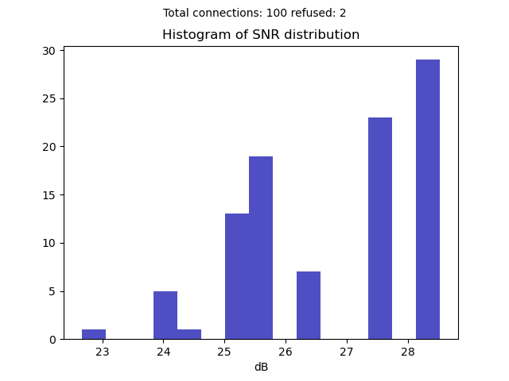

# Laboratory_OON
Exercises and laboratories of Open Optical Network course at Politecnico di Torino 2020-2021

### Python Lab (Part 1)
Python basics, Data Structures and Numpy

### Python Lab (Part 2)
Exercises with Pandas and JSON

### Lab 3
Implementation of SignalInformation, Node, Line and Network classes. Creation of a dataframe.

| Path       | Total latency | Total noise | Signal noise ratio |
|------------|---------------|-------------|--------------------|
| A->C->D->B | 0.0062        | 1.2472e-06  | 29.04061           |
| A->D->C    | 0.0037        | 7.4134e-07  | 31.29990           |

### Lab4
Implementation of RWA(snr, latency), creation of Connection class.

### Lab5
Ligthpath as an extension of the class SignalInformation, route_space dataframe.

| Path index | 0 | 1 | 2 | 3 | 4 | 5 | 6 | 7 | 8 | 9 |
|------------|---|---|---|---|---|---|---|---|---|---|
| 0          | 0 | 1 | 1 | 1 | 1 | 0 | 1 | 1 | 1 | 1 |
| 1          | 1 | 1 | 1 | 1 | 1 | 1 | 1 | 1 | 1 | 1 |

### Lab6
Implementation of the switching matrix as an attribute of the Node class.

### Lab7
Evaluation of the distributions of SNR, and dynamical change of the switching matrix.
Test on 100 of random connections.

### Lab8
Implementation of calculate_bit_rate method, different strategies (fixed, flex, shannon).

### Lab9 
Physical Layer abstraction, NLI and ASE implementation.

### Lab10
Optimize launch power implementation. Create connection starting form a Traffic Matrix
and display the stats.
g

